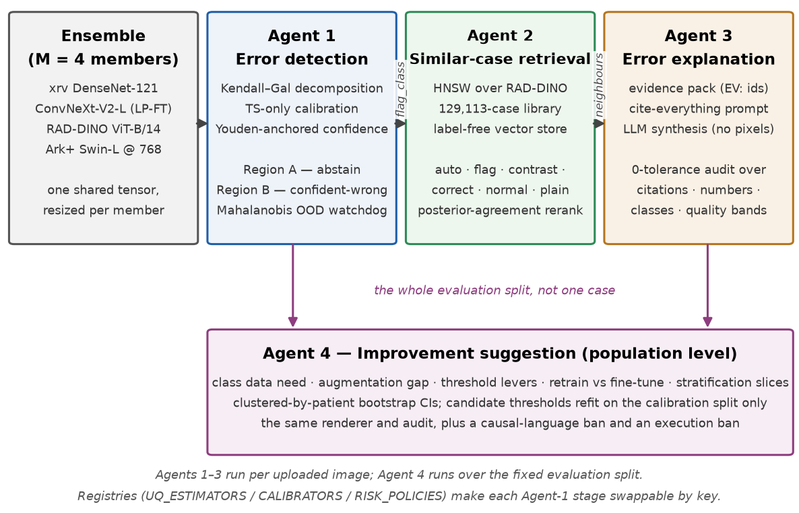

# System Design and Data Curation

This chapter describes what was built and how the data underneath it was prepared. Section 3.1 gives the system's overall shape and the design principle — a registry seam — that made a seven-phase research programme possible without rewriting the pipeline each time. Section 3.2 covers the ensemble members and the interface that lets encoders with different input conventions and different native resolutions share a single forward pass. Section 3.3 reports a probability-scale defect found in the first evaluation phase, whose diagnosis determined several later design decisions and is included because the reasoning, not just the fix, is part of the contribution. Sections 3.4 and 3.5 cover data curation, the leakage controls and the report labelling. Section 3.6 covers the compute strategy and the data-governance constraints under which the GPU work was done.

## System overview

{{fig:ch3-arch}} shows the system. Four agents sit on top of a shared ensemble. Agent 1 consumes the ensemble's per-member outputs and produces, for every image–pathology pair, a calibrated probability, a decision, a confidence, an epistemic uncertainty and a set of risk flags. Agent 2 consumes Agent 1's flag and retrieves comparable prior cases. Agent 3 consumes both and produces a short clinician-readable explanation. Agent 4 stands apart: it operates on the whole evaluation split rather than a single case, and produces population-level improvement hypotheses.

{#fig:ch3-arch}

Two properties of this composition are worth stating up front because they distinguish it from a generic agent pipeline. First, the couplings are *typed and narrow*. Agent 1 does not pass a natural-language summary to Agent 2; it passes a pathology name (`flag_class`) selected by an explicit rule from model internals only. Agent 2 does not pass images to Agent 3; it passes a neighbour block of identifiers, similarities and metadata. Every inter-agent edge is a data structure, which means every edge can be tested. Second, there is deliberately **no autonomous planner**: no LangGraph, no tool-calling loop, no agent deciding which agent to call next. The composition is fixed Python function calls. Section 9.2 argues this is the right choice for a clinical safety tool, where the value is in auditability rather than in flexible task decomposition.

### The registry seam

The research programme reported in Chapters 4 and 5 required swapping the uncertainty estimator, the calibrator and the risk policy repeatedly, while keeping every other part of the pipeline byte-identical so that comparisons remained valid. This is handled by three name-to-callable registries in `cxr_uncertainty/interfaces.py` — `UQ_ESTIMATORS`, `CALIBRATORS` and `RISK_POLICIES` — populated by decorators and resolved by key at run time. The command-line interface calls `get_risk_policy(cfg.risk_policy)` rather than naming a function, so adding a policy is a matter of registering a function and adding a key.

The payoff is concrete. Five calibrators are registered (`youden`, `bcts_ets_mondrian`, `ts_only`, `ts_only_mahalanobis`, `conformal_triage`) and two risk policies (`threshold`, `conformal_triage`). Each was added without touching the inference path, and the default path was asserted unchanged by a test (`get_risk_policy("threshold") is assess_image`), so every result in Chapter 4 was produced by the same forward pass and differs only in the post-hoc layer under study. That is what makes the calibration ablation in Section 4.4 an ablation rather than a comparison of separate runs.

## The ensemble and the member interface

The system supports two model registries. The legacy registry holds six torchxrayvision DenseNet-121 classifiers [@cohen2022; @huang2017], each trained on a different public corpus, which constitute a "free" deep ensemble of genuinely independently trained members. The architecture-primary registry, used for all results reported here, holds six members spanning five distinct representation strategies, listed in {{tab:ch3-members}}.

Table: {#tab:ch3-members} The architecture-primary ensemble members. The four deployed members are the first, second, third and sixth rows; BiomedCLIP and the second xrv member were built for the member-count study in Section 4.6.

| Member | Backbone | Pretraining | Adaptation | Native size |
|---|---|---|---|---|
| `xrv_nih` | DenseNet-121 | supervised, NIH ChestX-ray14 | pretrained head | 224 |
| `convnextv2` | ConvNeXt-V2-Large | FCMAE on ImageNet | linear probe then fine-tune | 224 |
| `raddino` | ViT-B/14 (RAD-DINO) | self-supervised on radiographs | frozen + linear probe | 224 |
| `arkswin` | Swin-Large (Ark+) | supervised, six CXR corpora | frozen + linear probe | 768 |
| `biomedclip` | ViT-B/16 (BiomedCLIP) | image–text contrastive | frozen + linear probe | 224 |
| `xrv_padchest` | DenseNet-121 | supervised, PadChest | pretrained head | 224 |

The diversity is deliberate and is the independent variable of Chapter 5: a supervised convolutional network, a self-supervised vision transformer, a masked-autoencoder convolutional network, a supervised multi-corpus transformer and a contrastive image–text model represent five genuinely different inductive biases, not five seeds of one.

### One tensor, many input conventions

Each member exposes a `Member` interface returning a `MemberOutput` with four fields: true raw logits, probabilities, penultimate features, and a per-class validity mask. The mask matters because members do not all define the same classes — the torchxrayvision members leave several of their eighteen output slots untrained — and an undefined class must contribute nothing rather than contribute a zero. `Alignment.stack` maps each member's native output slots onto the shared NIH-14 ontology, inserting not-a-number where a member has no opinion, and returns tensors of shape (members × batch × pathologies).

Resolution is handled once rather than per member. The loader fetches each image at the maximum native size across the ensemble, and `forward_ensemble_full` resizes the shared tensor per member by bilinear interpolation. This lets a 768-pixel Ark+ Swin member coexist with 224-pixel members in a single forward pass. That the downsampling does not perturb the 224-pixel members was verified rather than assumed: per-image Mahalanobis scores computed by a three-member ensemble loading at 224 and by a five-member ensemble loading at 768 and downsampling correlate at Spearman ρ = 0.9977 on identical images.

Keeping true logits separate from probabilities is likewise deliberate. Temperature scaling must be fitted on real logits, whereas the torchxrayvision members' probability convention involves an operating-point normalisation and a second sigmoid. Storing both means the calibration path is clean while the historical probability convention remains available.

## A probability-scale defect and what it revealed

The first two-member evaluation produced a confident-error AUROC far below chance — the cross-member standard deviation was systematically flagging confidently-*correct* predictions as uncertain. The cause was a scale mismatch. The torchxrayvision probability convention applies an operating-point normalisation followed by a second sigmoid, which compresses probabilities into roughly [0.5, 0.73]; the ConvNeXt member's plain sigmoid spans the full unit interval. Taking a standard deviation across members on those two scales measures the difference in scale conventions, not disagreement about the image, and because the compression is strongest where one member is most certain, the resulting statistic is anti-correlated with correctness.

The fix was to put every member of one ensemble on a single probability scale, and the architecture-primary registry therefore specifies plain sigmoid for its torchxrayvision entries. The reason for reporting this at length is that the diagnosis generalises: **cross-member disagreement is only meaningful when the members' probabilities are commensurable**, and any per-member transformation that changes scale conventions differently across members will corrupt it. Section 4.4 confirms the general form of this: per-member Beta calibration, which improves the reported calibration number, degrades the confident-error AUROC by roughly 0.18 because it normalises away exactly the inter-member scale structure that carries the signal. The defect and the ablation are the same phenomenon observed from two directions.

A related negative was recorded early. Monte Carlo dropout was implemented as a potential rescue for the weak two-member signal, and rejected: the torchxrayvision DenseNet has no inference-time dropout layers, so the procedure is a no-op, and where it was applied the top-decile confident-error AUROC fell from 0.71 to 0.55 — dropout noise does not separate rare confident errors. The system detects the absence of dropout automatically and reports it, so this is documented behaviour rather than a silent no-op.

## Data curation and leakage control

{{fig:ch3-splits}} shows the two corpora and their splits.

{#fig:ch3-splits}

The primary manifest holds 22,018 images from 11,199 patients across NIH ChestX-ray14 [@wang2017], CheXpert [@irvin2019] and Open-i [@demner2016], assigned to four roles: A for member training (16,002), B for per-member calibration (2,002), C for ensemble calibration (2,002 OpenI) and D for leak-free evaluation (2,012 OpenI). All labels are mapped to a canonical NIH-14 ontology with a per-source validity mask, since CheXpert does not define Nodule, Emphysema, Fibrosis or Hernia, and the OpenI subset has no Consolidation positives.

Three leakage controls are enforced rather than intended.

- **Patient-level splitting.** Splits are patient-disjoint, not image-disjoint. This is not a formality: the heaviest patient in the manifest contributes 65 images, and several others contribute 40–55, so an image-level random split would have scattered up to 65 correlated films of one patient across the train/evaluation boundary.
- **Weight exclusion.** The torchxrayvision `all` weights were trained on a superset containing OpenI. They are excluded from every ensemble evaluating OpenI, and two of the six assertions in `tests/test_leak_free.py` fail the build if they reappear.
- **Ontology validity.** The validity masks are asserted to match each source's actual label coverage, so that a class a source never labelled cannot silently contribute a zero.

The evaluation split's class support is reported honestly here because it determines what Chapter 4 can and cannot claim. Role D contains 5 Mass positives, 8 Fibrosis, 8 Pleural Thickening and 0 Consolidation. Per-pathology results on those classes are not interpretable, and — as Section 4.3 shows — the whole-split confident-error estimate rests on 8 confident errors, which is the observation that forced the move to a larger corpus.

That corpus is ReXGradient-160K [@rexgradient2025]. Its value here is a property no curation can provide: it was released in 2025, after every pretrained encoder in the ensemble was trained, so it is **leak-free by recency**. The frontal subset was split patient-disjointly into 112,967 training, 8,064 calibration and 8,082 evaluation images.

## Report labelling

ReXGradient supplies free-text reports rather than structured labels, so labels were derived with the CheXpert rule-based labeller [@irvin2019], which builds on NegBio's negation and uncertainty detection [@peng2018negbio], run in a container over 129,113 reports and mapped to the NIH-14 ontology. Ten of the fourteen classes are comparable after the mapping.

The labeller emits four states: positive, negative, uncertain and blank. The *uncertain* state is retained rather than discarded, because it is the target of one of the benchmark tasks in Chapter 5 — predicting which cases a reader found ambiguous is a plausible use for an uncertainty score. Two caveats attach and are carried through every claim made from these labels. First, training uses a policy that maps uncertain to positive, which is standard but is a choice. Second, and more importantly, **these uncertain labels are inferred by a rule-based tool from report language, not asserted by an expert**. A result on them is evidence about the labeller's notion of hedged phrasing as much as about clinical ambiguity, and Section 5.6 reports that task as tentative throughout. A corpus with native expert uncertainty labels would be the proper test; the one identified for that purpose during this project became unavailable when the New Zealand government prohibited its use, and no substitute was in scope.

## Compute, environment and data governance

Development and all analysis ran on a CPU-only macOS host with Python 3.12; PyTorch [@paszke2019], scikit-learn [@pedregosa2011] and Gradio [@abid2019gradio] are the principal dependencies. Training — fifteen from-scratch models and six adapted members — ran on rented H100 GPUs.

Two constraints shaped that arrangement. The first was throughput. Training from 16-bit PNGs was CPU-decode-bound at 196 seconds per epoch with the GPU essentially idle; pre-decoding the corpus into a float32 memory-mapped cache reduced this to about 22 seconds per epoch, a ninefold improvement, and is what made a fifteen-model control study affordable within the project's budget.

The second was governance, and it is a hard constraint rather than an engineering preference. ReXGradient is distributed under a data-use agreement that forbids persistence on third-party infrastructure. The working pattern was therefore: upload the pre-decoded cache with an end-to-end SHA-256 verification, train, pull checkpoints and derived arrays back to the local host, then delete every image, cache, manifest and label file from the GPU host and verify the deletion by a repository-wide scan. All results in Chapters 4 and 5 are reproducible from the saved arrays without re-running inference, which is what makes the deletion possible without losing the work. Section 9.5 returns to this, and Section 9.6 describes the corresponding controls on code publication.
