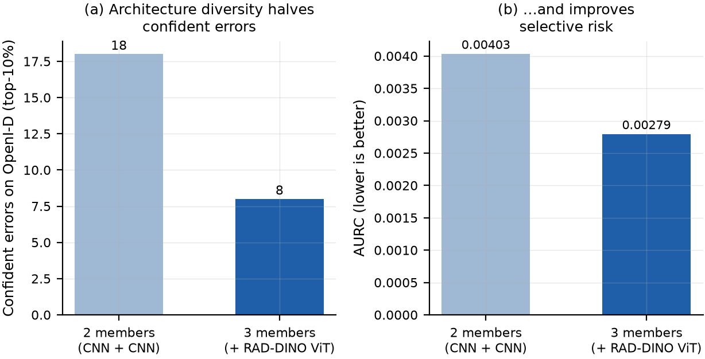
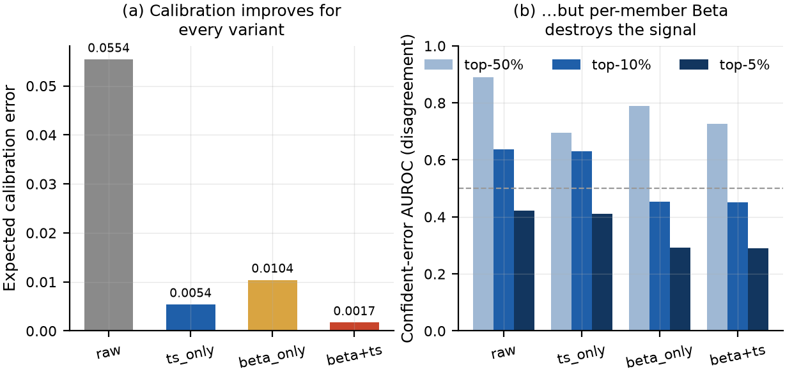
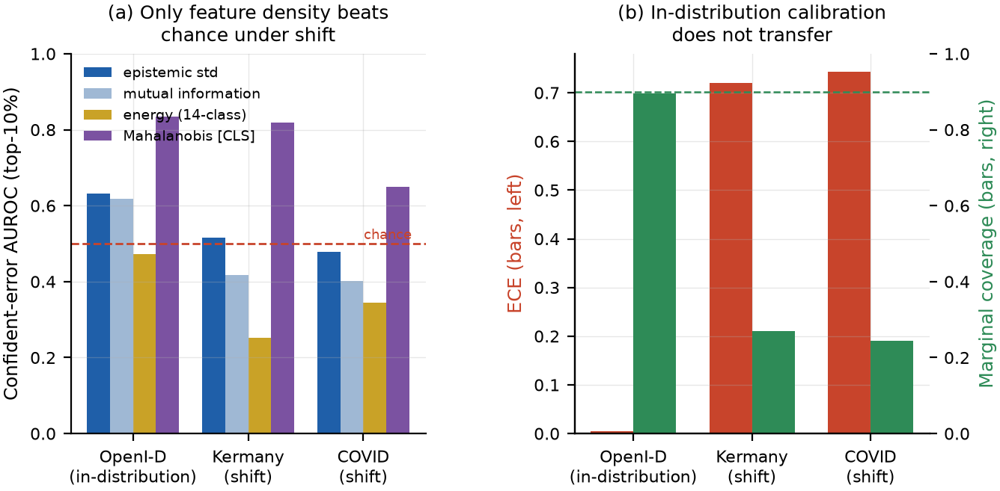
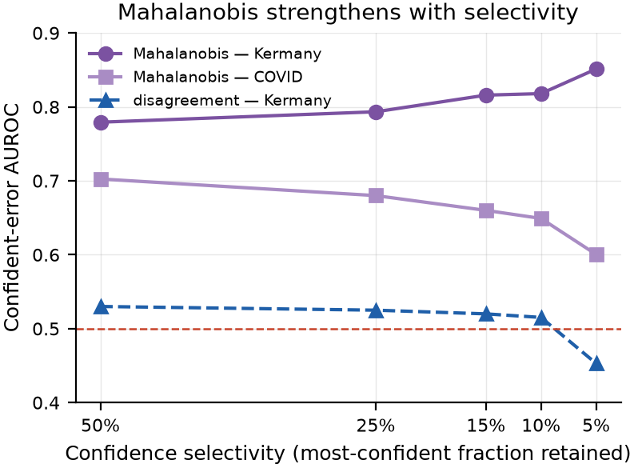
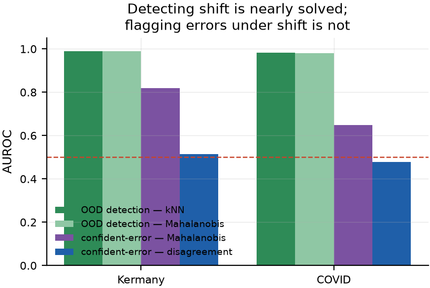

# Agent 1: Uncertainty Quantification and Confident-Error Flagging

This chapter presents the error-detection agent and the experimental programme that shaped it. Section 4.1 states what the agent computes. Section 4.2 defines the defining metric precisely, because much of the argument in this dissertation turns on its exact form. Sections 4.3 to 4.8 then report the results in the order they were obtained, because the order is the argument: a promising two-member result, an architecture-diversity gain that improved selective risk while *weakening* the top-decile flag, a calibration ablation that localised the signal, a decisive negative under distribution shift, a feature-density score that survived that shift, a member-count study that hit the agree-wrong ceiling, and a conformal layer whose guarantee holds exactly where the density score is not needed and voids exactly where it is. Section 4.9 draws the design conclusions and states the problem that Chapter 5 exists to solve.

## What the agent computes

For each image the ensemble produces per-member probabilities for fourteen pathologies with a validity mask. Agent 1 pools these into a mean, applies the Kendall–Gal decomposition of Equation {{eq:ch2-kg}} to obtain predictive entropy, expected entropy and mutual information, and additionally computes the cross-member standard deviation.

Decisions are not taken at a fixed 0.5 threshold. The pretrained members are uncalibrated on any corpus they were not trained on, and their pooled means sit in a narrow band, so a global 0.5 threshold predicts *present* for essentially everything. Instead a per-class threshold is fitted on the calibration split by Youden's J statistic [@youden1950], and confidence is defined as the normalised distance of the pooled mean from that class threshold:

$$ conf = (p̄ − t) / (1 − t) if predicted present,  (t − p̄) / t otherwise $$ {#eq:ch4-conf}

Equation {{eq:ch4-conf}} yields a confidence in [0, 1] that is zero at the decision boundary and one at the extreme, for both polarities. It is this quantity, not the raw probability, that defines the confident stratum.

Calibrated probabilities come from temperature scaling of the pooled mean, fitted on the calibration split. Critically, the **raw** per-member probabilities are retained for the disagreement computation; Section 4.4 explains why this separation is not an implementation detail.

## The defining metric

The confident-error AUROC is computed as follows. Let `is_conf` be the top *k*% of image–pathology records by the confidence of Equation {{eq:ch4-conf}}, and let `wrong` be the indicator that the decision disagrees with the label. Then:

```
confident_error_auroc(score) = AUROC( score[is_conf], wrong[is_conf] )
```

That is: restrict to the confident stratum, then measure how well the uncertainty score ranks the wrong predictions above the correct ones. It is computed for the cross-member standard deviation, for mutual information, for the Mahalanobis distance, and — as the baseline that matters — for negated confidence itself. It is reported across a selectivity ladder of the top 50%, 25%, 15%, 10% and 5%, never at a single operating point, so that a result driven by one gate choice is visible as such.

Two properties of this metric are worth making explicit. First, its sample size is the number of *confident errors*, not the number of images; a 2,012-image evaluation split with a 2% positive rate can easily contain fewer than ten. Second, because it is a ranking metric, it is invariant to temperature scaling (Section 2.3) — a poor value cannot be a calibration problem.

Alongside it, the agent reports ECE at four bin counts with reliability diagrams, Brier with the Murphy decomposition, negative log-likelihood, AURC and E-AURC per score, the risk–coverage curve, per-pathology task AUROC, and — where a conformal policy is active — per-pathology coverage, average set size and referral rate. Statistical comparisons use DeLong's test for correlated ROC curves [@delong1988], McNemar's test for paired flag decisions [@dietterich1998] and bootstrap confidence intervals [@efron1993].

## Ensemble growth: diversity helps, and the flag gets harder

The first configuration paired the NIH DenseNet with the fine-tuned ConvNeXt-V2. After the scale fix of Section 3.3, it achieved a top-decile confident-error AUROC of 0.713 with ECE 0.034 and AURC 0.00403 on the 2,012-image leak-free split, with 18 confident errors. But the selectivity curve was *decreasing* — 0.84 at the top half falling to 0.64 at the top decile — which is the wrong direction: a flag should get sharper as one restricts to more confident cases, not blunter. Two members from the same architectural family correlate on exactly the confident errors that matter.

Adding the RAD-DINO vision transformer, whose frozen linear probe reached macro-AUC 0.799 against ConvNeXt's 0.705, tested that hypothesis directly. {{fig:ch4-growth}} shows the outcome.

{#fig:ch4-growth}

Confident errors fell from 18 to 8 (−56%), errors in the top half from 1,071 to 387 (−64%), and AURC from 0.00403 to 0.00279 (−31%). Architecture diversity plainly earned its place. Yet the top-decile confident-error AUROC *fell*, from 0.713 to 0.639, and the top-5% figure fell from 0.639 to 0.423.

This is not a contradiction, and reading it correctly was important. A better ensemble removes the easy confident errors; what survives is a harder residue, and the flag is being asked to rank a smaller and more adversarial set. At the top 5% only two errors remained, at which point the statistic is not meaningful. The episode produced the project's first methodological conclusion: **the in-distribution benchmark was too small to measure the thing it was built to measure**, and either a probe with many confident errors or a much larger corpus was required. Both were subsequently obtained; the probe is Section 4.6 and the corpus is Chapter 5.

## The calibration ablation

Before enlarging the benchmark, one competing explanation had to be eliminated: that the weak top-decile behaviour was a calibration artefact. Four calibration variants were run on the *identical* three-member forward pass, which the registry seam of Section 3.1.1 makes possible. Results are in {{tab:ch4-calib}} and {{fig:ch4-calib}}.

Table: {#tab:ch4-calib} Calibration ablation on the identical three-member forward pass over the 2,012-image leak-free split. "cw" is the number of confident errors; the AUROC columns are the confident-error AUROC of cross-member disagreement at each selectivity.

| Variant | ECE | AURC | cw | top-50% | top-25% | top-15% | top-10% | top-5% |
|---|---|---|---|---|---|---|---|---|
| raw | 0.0554 | 0.00279 | 8 | 0.889 | 0.695 | 0.698 | 0.639 | 0.423 |
| **ts_only** | **0.0054** | 0.00284 | 8 | 0.695 | 0.694 | 0.700 | 0.631 | 0.410 |
| beta_only | 0.0104 | 0.00411 | 9 | 0.790 | 0.588 | 0.517 | 0.454 | 0.292 |
| beta + ts | 0.0017 | 0.00415 | 9 | 0.726 | 0.586 | 0.515 | 0.450 | 0.289 |

{#fig:ch4-calib}

Temperature scaling alone improves ECE roughly tenfold while leaving the confident-error ordering essentially untouched (top-10% 0.639 → 0.631), exactly as rank-invariance predicts. Per-member Beta calibration produces a *better* ECE still — and costs 0.18 AUROC at the top decile. The mechanism is the one diagnosed in Section 3.3 from the opposite direction: Beta calibration, fitted independently per member, normalises away the inter-member scale differences, and those differences are part of what makes the cross-member standard deviation informative about error. A calibration procedure can therefore improve the honesty of the probabilities and simultaneously destroy the ranking capability of the uncertainty derived from them.

Two conclusions follow. Operationally, **temperature scaling on the pooled mean, with raw member probabilities retained for disagreement, is the production design**, and per-member Beta calibration is rejected. Methodologically, the weak top-decile behaviour is *not* a calibration artefact — it is under-powering plus an irreducible residue of confident agreement on wrong answers, which is Abe et al.'s finding [@abe2022] appearing in this system's own numbers.

## Distribution shift: a decisive negative

The powered probes are Kermany's paediatric pneumonia collection [@kermany2018] and the COVID-19 Radiography Database [@rahman2021], both reduced to the single NIH Pneumonia class and both leak-free with respect to every member. Between them they supply 244 and 313 confident errors — thirty to forty times the in-distribution count. The calibration fitted on OpenI was applied unchanged, which is what a deployed system would do.

The result, shown in {{fig:ch4-ood}}(a), is unambiguous: the disagreement flag is at or below chance. Confident-error AUROC is 0.515 on Kermany and 0.478 on COVID, with mutual information worse still at 0.418 and 0.402.

{#fig:ch4-ood}

Two compounding failures explain it, and both were predicted by theory. First, calibration does not transfer: ECE rises from 0.0054 to 0.72 and 0.74 ({{fig:ch4-ood}}(b)), because the probes' pneumonia prevalence is 73–75% against OpenI's 2%. Second, and more fundamentally, the surviving errors are the confident-agree-wrong core: under shift the architecturally distinct members do not disagree, they agree confidently on the wrong answer. A disagreement statistic has nothing to measure. This is the hard ceiling on disagreement-based uncertainty, and no amount of recalibration moves it.

## Feature density: the score that survives shift

If the output layer's uncertainty is uninformative under shift, the representation may not be. A two-class Mahalanobis detector [@lee2018] with Ledoit–Wolf shrinkage [@ledoit2004] was fitted on the frozen RAD-DINO 768-dimensional class token, using only in-distribution calibration data, and evaluated unchanged on the probes.

It beats chance decisively where disagreement cannot: confident-error AUROC 0.818 on Kermany and 0.649 on COVID, against 0.515 and 0.478 for disagreement. Its recall of confident errors at the deployed false-flag budget is 0.787 and 0.655. Fourteen-class energy [@liu2020energy], by contrast, is actively anti-diagnostic at 0.253 and 0.344 — logit magnitude from a linear head is not the right axis under shift, whereas feature-space density is. This reproduces the medical-imaging finding of Woodland et al. [@woodland2024] that non-parametric and parametric density scores behave very differently from logit-based ones on clinical data.

{{fig:ch4-maha}} shows a property that matters more than the headline number: on Kermany the Mahalanobis score *strengthens* monotonically with selectivity, 0.779 → 0.793 → 0.816 → 0.818 → 0.851 across the top 50% to top 5%. That is the behaviour a triage flag is supposed to have and the behaviour disagreement conspicuously lacks.

{#fig:ch4-maha}

A caution belongs here, and Chapter 5 will enforce it. The same fit reported a confident-error AUROC of 0.835 *in-distribution* on the 2,012-image split. That number rests on eight confident errors, and Section 5.2 shows it does not survive replication at power. The out-of-distribution numbers, resting on 244 and 313 errors, do.

It is also worth separating two questions that this score is often asked to answer at once. As a pure out-of-distribution *detector* — is this image from the training distribution? — feature-space scores are close to solved: {{fig:ch4-detect}} shows AUROC 0.990 for Mahalanobis and 0.990 for *k*-NN distance on Kermany, and 0.980 and 0.983 on COVID, with energy again failing at 0.47. As a *confident-error* flag under that same shift, the very same scores reach only 0.65–0.82. Detecting that the input is unfamiliar is much easier than knowing which confident prediction on it is wrong, and reporting the first as if it settled the second overstates what the layer delivers.

{#fig:ch4-detect}

## Member count and the agree-wrong ceiling

Ensemble-diversity theory suggests returns to member count with a knee around five. Two further members — Ark+ Swin-Large at 768 pixels, the strongest single member at probe macro-AUC 0.858, and BiomedCLIP at 0.761 — were added and the ensemble re-evaluated on matched arrays.

The result splits cleanly. On selective risk, five members beat three: in-distribution AURC falls from 0.0030 to 0.0014, a 53% reduction. On the disagreement flag, five members are *worse* everywhere: top-5% confident-error AUROC falls from 0.534 to 0.299 in-distribution, and from 0.453 to 0.410 on Kermany.

The explanation is the agree-wrong core again. The two added members are strong and, on the confident errors that survive, correlated with the existing members; adding them dilutes the cross-member standard deviation precisely where it was supposed to fire. **Adding members improves risk–coverage but cannot improve a disagreement-based confident-error detector beyond the irreducible agree-wrong residue.** This is the clearest single piece of evidence in the in-distribution programme that the disagreement flag has a structural ceiling, and it is why the production flag is the density score rather than the disagreement.

## Conformal triage: a guarantee, and its exact boundary

The final layer supplies what a heuristic flag cannot: a distribution-free coverage guarantee. Mondrian per-label LAC conformal prediction [@sadinle2019; @vovk2005] was fitted on the temperature-scaled pooled mean using the ensemble calibration split, producing one threshold per pathology at α = 0.1.

In-distribution the guarantee holds tightly. Marginal coverage is 0.896 against the 0.90 target, and every one of the thirteen valid pathologies lies within two percentage points of target, from 0.884 (Edema) to 0.913 (Emphysema). Average set size is 0.91 and the referral rate is 0.077. This is a genuine distribution-free statement of a kind the Mahalanobis flag cannot make.

Under shift it does not degrade; it voids. Coverage falls to 0.269 on Kermany and 0.245 on COVID ({{fig:ch4-ood}}(b)). Worse than the number is its shape: the prediction sets remain size-one, and the referral rate stays near 0.03. The system therefore continues to auto-read predictions it is now getting wrong, without referring them. Measured as an error flag under shift, the conformal referral has recall 0.0 — it never fires — where the Mahalanobis flag has recall 0.79 and 0.65.

That is exactly the complementarity the design anticipated, and it is the operational conclusion of this chapter: **conformal prediction is an in-distribution coverage layer and Mahalanobis is an under-shift safety net, and a defensible system carries both.** Neither substitutes for the other, because each is strongest where the other is void.

## Design conclusions, and the problem that remains

Agent 1's production configuration follows from the above. Temperature scaling on the pooled mean with raw member probabilities retained; per-member Beta rejected; Youden-anchored per-class thresholds and confidence; Mahalanobis on frozen RAD-DINO features as the distribution-shift flag; Mondrian LAC conformal as the in-distribution coverage layer; disagreement retained but understood to have a ceiling. A representation-mismatch score was also developed as a targeted attack on the agree-wrong core, fitting class-conditional densities per pathology and shipping only where it beat the confidence baseline at a fixed false-flag budget; on RAD-DINO features it shipped for five pathologies, and on Ark+ Swin features for nine, with Edema at AUROC 0.873 against a confidence baseline of 0.695.

But the central question is not settled, and the reason is stated plainly. Every in-distribution number in this chapter — the 0.639, the 0.835, the calibration ablation — rests on **eight confident errors** in a 2,012-image split. That is not a benchmark; it is an anecdote with error bars wide enough to accommodate almost any conclusion. Whether cross-member disagreement adds anything over pooled confidence for confident-error flagging cannot be answered here, and the honest response is not to report the favourable number but to obtain a corpus large enough to test it. Chapter 5 does that, and the answer is not the one the project was built to find.
