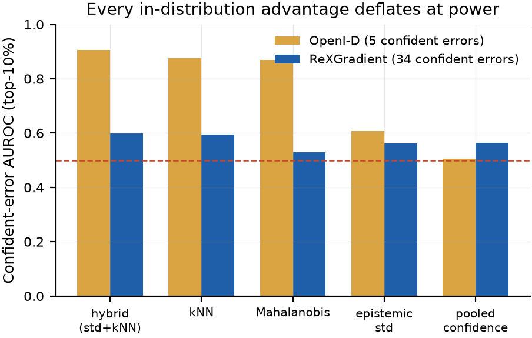
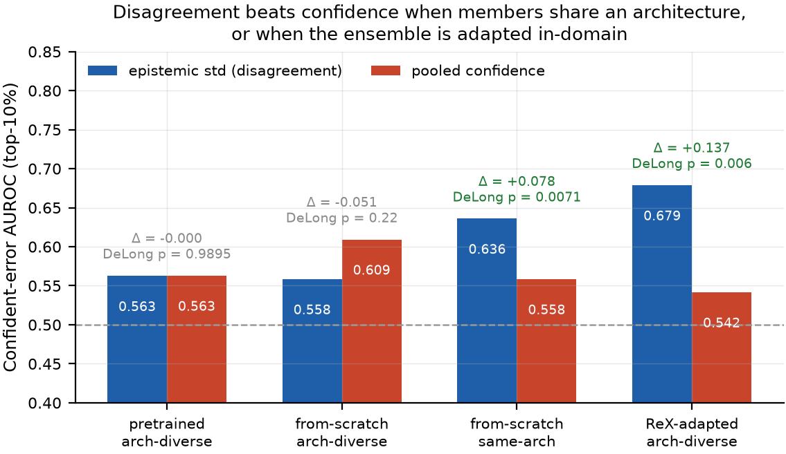
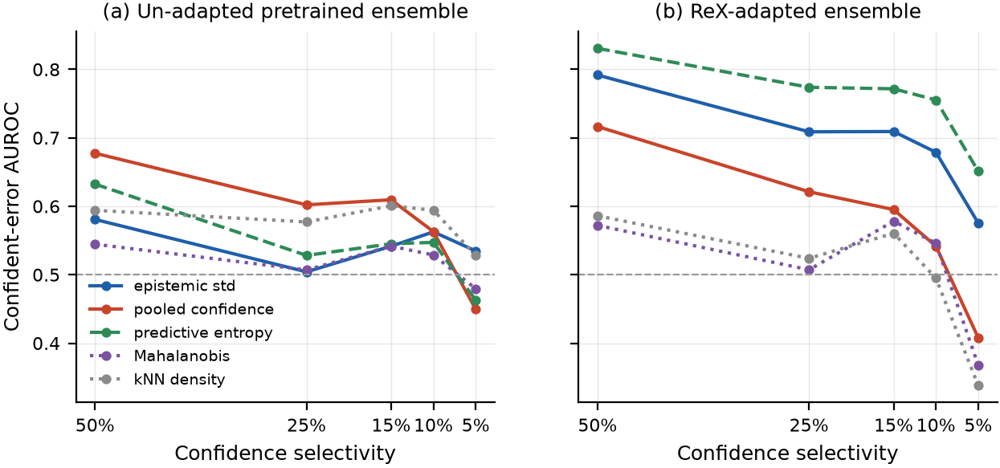
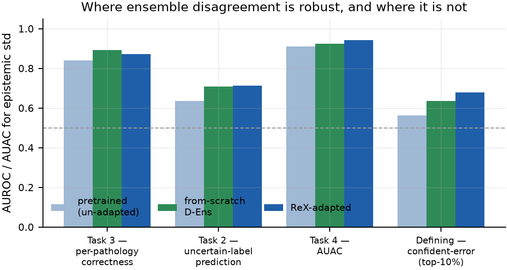
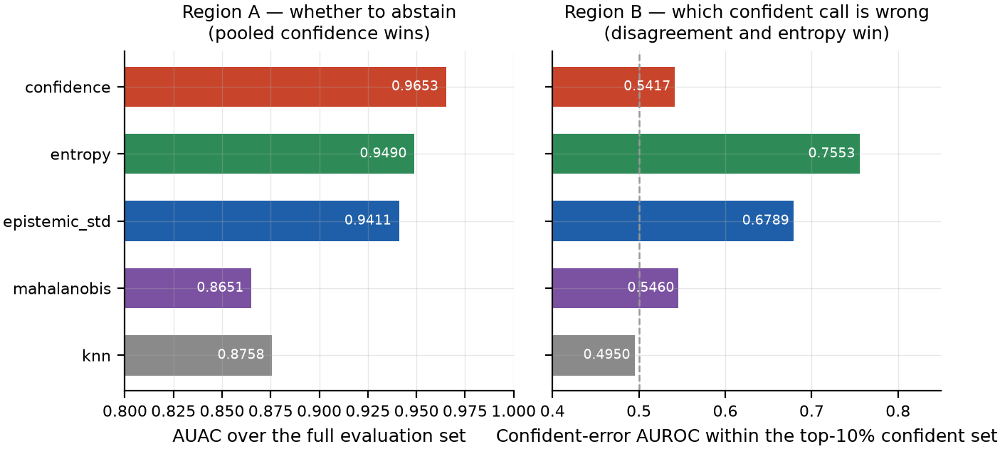

# Powered Evaluation: The Regime and Diversity Study

Chapter 4 ended with a benchmark too small to answer its own question. This chapter answers it. Section 5.1 describes the powered corpus and protocol. Section 5.2 reports the result, which is negative and which deflates every in-distribution advantage the project had accumulated. Section 5.3 reframes that negative by asking which task the ensemble actually helps with. Section 5.4 builds the control experiment that gives the negative meaning. Section 5.5 decomposes the two explanatory factors that the control confounds, using a recombination that cost no additional compute and that overturns the control's own attribution. Section 5.6 closes the last competing explanation by adapting the ensemble to the deployment corpus. Section 5.7 synthesises the whole into a two-region usage rule, and Section 5.8 states the limitations honestly.

## Protocol

The powered corpus is the ReXGradient-160K frontal subset [@rexgradient2025], split patient-disjointly into 8,064 calibration and 8,082 evaluation images with 112,967 held for training in later sections. Its decisive property is that it postdates the pretraining of every member, so it is leak-free by recency; no curation could establish the same for a corpus that predates the encoders.

At the top-decile gate the evaluation split yields **34 confident errors** against the OpenI split's five — a factor of about seven, and the difference between an estimate and an anecdote. Calibration is fitted within the corpus, on its own calibration split, which is the protocol Baur et al. [@baur2025] follow within MIMIC and is what a hospital deploying the system would do.

Four members are used: `xrv_nih`, `convnextv2`, `raddino` and `arkswin`. Batched inference ran on an H100 in approximately 21 minutes; all patient data was deleted from the host afterwards per Section 3.6. Every score in this chapter is recomputed from the saved arrays, so the comparisons that follow share one forward pass exactly.

Alongside the defining metric, the four tasks of Baur et al. are reported so that the result is comparable: Task 2 predicts the labeller's *uncertain* annotation, Task 3 predicts per-pathology correctness, and Task 4 measures accuracy against coverage (AUAC) under progressive abstention.

## The result: the advantage does not survive power

{{fig:ch5-power}} shows what happens to every score when the benchmark is enlarged.

{#fig:ch5-power}

Three findings, in order of importance.

**Disagreement is statistically indistinguishable from pooled confidence.** At the top decile, cross-member standard deviation scores 0.5626 and pooled confidence scores 0.5630. DeLong's test gives *p* = 0.99; McNemar's test on the resulting binary flags gives *p* = 0.98, meaning the two flags disagree on approximately no cases. Cross-member disagreement — the signal this project was built around — adds nothing over the pooled mean for flagging confident errors once the benchmark is adequately powered.

**The feature-density advantage was a small-sample artefact.** Mahalanobis falls from 0.8698 on OpenI to 0.5288 on ReXGradient; the hybrid of disagreement and *k*-NN falls from 0.9059 to 0.5979. The OpenI numbers were computed on five confident errors. They were not wrong as arithmetic; they were never estimates of anything stable. This is the clearest cautionary case the project produced, and it is reported at length because the temptation to publish the 0.91 was real. Note carefully what does *not* deflate: the **out-of-distribution** Mahalanobis result of Section 4.6, resting on 244 and 313 confident errors, stands. Mahalanobis is a distribution-shift detector; it is not an in-distribution confident-error flagger at power.

**A single member beats the ensemble.** The ConvNeXt member's own confidence scores 0.6077 against the ensemble's 0.5626, and DeLong gives *p* = 0.0007. The four-member ensemble's disagreement is worse at this task than one of its own members' confidence.

Two supporting observations rule out obvious alternative explanations. Calibration is not responsible: ECE is already 0.0219 and temperature scaling moves it only to 0.0207, and the AUROC of the negated pooled mean is 0.4527 both before and after — rank-invariance again, so temperature scaling cannot have moved the ranking. And the members are not individually good at self-detection either: each member's own confidence, evaluated against its own errors, scores 0.44, 0.35, 0.46 and 0.46 at the top decile, all at or below chance. Both the individual and the collective signals are weak here.

## Reframing: which task does the ensemble actually help with?

A negative on one metric is only informative if the other metrics are reported alongside it. {{tab:ch5-tasks}} gives all four.

Table: {#tab:ch5-tasks} The four benchmark tasks on the powered corpus, showing the best ensemble-family score for each. The ensemble's value is real but is not located at the defining metric.

| Task | Best ensemble-family score | Verdict |
|---|---|---|
| Task 3 — per-pathology correctness (macro over 10) | epistemic std 0.8391; confidence 0.9175 | strong, but confidence stronger |
| Task 2 — uncertain-label prediction (2,509 rows) | entropy 0.6983; epistemic std 0.6353 | tentative (labeller-inferred labels) |
| Task 4 — accuracy against coverage (AUAC) | confidence 0.9552; epistemic std 0.9093 | pooled confidence wins |
| **Defining — confident-error flag (top 10%)** | single-member confidence 0.6077; kNN 0.5942 | disagreement ≈ confidence |

Two structural findings emerge. The density score with genuine legs is ***k*-NN, not Mahalanobis** (0.5942 against 0.5288), reproducing Woodland et al. [@woodland2024] on medical features. And **energy fails on every task** — 0.4509 at the defining metric, 0.6447 AUAC, 0.3346 on Task 2 — reproducing the same finding in the wider out-of-distribution literature.

This also permits a precise reconciliation with the closest prior work. Baur et al. [@baur2025] report the best of predictive, aleatoric and epistemic uncertainty per method per task, so "ensembles win" is compatible with the *pooled* score winning while the *disagreement* contributes nothing. That is exactly what is observed here: predictive entropy and the confidence family carry the coverage tasks, and the epistemic disagreement does not carry the flagging task. Disentangling which score carries which task is precisely what a best-of-three reporting convention conceals.

At this point the honest claim would be a negative: ensemble disagreement does not improve confident-error flagging over pooled confidence at power. But that claim is unbounded — it does not say whether the method fails, or whether *this kind of ensemble* fails — and an unbounded negative is not a useful contribution. The remaining sections bound it.

## The from-scratch control

Baur et al. find that disagreement *does* carry signal, in a regime this project's ensemble does not occupy: five independent random-initialisation trainings of a single architecture. The obvious hypothesis is that the deflation is a property of frozen foundation encoders. Testing it requires building their object on this corpus.

Fifteen models were trained from scratch — three backbones (ResNet-18, ViT-Tiny, ConvNeXt-Tiny) at five seeds each — on the 112,967-image ReXGradient training split, with identical splits, labels and evaluation code to Section 5.2. "From scratch" is meant strictly: random initialisation, no pretraining of any kind. Training followed Baur's cheap protocol (224 pixels, roughly 25 epochs, early stopping, no tuning toward state of the art) because the point is comparability, not maximum accuracy.

The hypothesis is confirmed for all three backbones. Top-decile confident-error AUROC for disagreement against confidence: ResNet-18 0.636 against 0.559, ViT-Tiny 0.719 against 0.674, ConvNeXt-Tiny 0.669 against 0.539 — gains of +0.045 to +0.130, with DeLong *p* = 0.0071, 0.060 and below 0.0001 at the top decile and *p* < 0.0001 for all three at the top half. Against the frozen-foundation *p* = 0.99, this is a clean regime difference.

The mechanism appeared to be member weakness. Each from-scratch member's own confidence, against its own errors, scores 0.47, 0.43 and 0.52 at the top decile — a single from-scratch member cannot tell its own errors from its correct calls at all. The ensemble's value comes entirely from cross-member disagreement: five weak members disagree precisely where they err. The frozen foundation members, by contrast, are strong individuals that agree, so their disagreement is a rescaled confidence and adds nothing.

Three cross-regime invariants also emerged, and they matter for the design conclusions. Mahalanobis is near chance in-distribution in *both* regimes (0.53, 0.51, 0.52 from scratch against 0.53 pretrained), confirming that Section 4.6's conclusion is universal rather than foundation-specific. Pooled confidence wins full-coverage abstention in both regimes (AUAC 0.955, 0.938, 0.943 against disagreement's 0.923, 0.903, 0.899). And *k*-NN density, which helps on frozen RAD-DINO features, adds nothing from scratch — the hybrid selector chooses a weight of 1.0 on disagreement for all three backbones, making the hybrid identical to disagreement.

A further observation reverses a ranking from Chapter 4: predictive entropy is the strongest single score in the from-scratch regime (0.659, 0.761, 0.716), above both disagreement and confidence, because it folds in both. In the pretrained regime entropy was *below* confidence at 0.547. The ranking of scores flips with the regime, tracking where the signal lives.

## Separating regime from diversity

The comparison in Section 5.4 is confounded, and noticing this is the pivot of the whole chapter. Section 5.2's ensemble is **architecture-diverse and pretrained**; Section 5.4's is **same-architecture and from scratch**. Two factors change at once, and the attribution to "regime" is an assumption, not a measurement.

The missing cell is an architecture-diverse *from-scratch* ensemble, and it turned out to be free. The three backbones' per-member predictions already existed in the saved arrays with verified identical image ordering, so stacking the seed-0 predictions across backbones constructs a cross-architecture from-scratch ensemble with no new training and no new inference. A matched same-architecture ensemble at the same member count controls for member count. Both were built, at M = 3 and again at M = 2.

Table: {#tab:ch5-cells} The regime × diversity decomposition at the defining top-decile metric, with a same-architecture control at matched member count. Δ is disagreement minus confidence.

| Ensemble | Diversity | Regime | M | std | conf | Δ | DeLong *p* |
|---|---|---|---|---|---|---|---|
| Phase 5 | arch-diverse | pretrained | 4 | 0.5626 | 0.5630 | −0.000 | 0.99 |
| **crossarch** | **arch-diverse** | **from-scratch** | 3 | **0.5585** | 0.6093 | **−0.051** | 0.22 |
| resnet18 ×3 | same-arch | from-scratch | 3 | 0.6453 | 0.5455 | +0.100 | 0.012 |
| **crossarch (CNN↔ViT)** | **arch-diverse** | **from-scratch** | 2 | **0.5266** | 0.5348 | **−0.008** | 0.79 |
| resnet18 ×2 | same-arch | from-scratch | 2 | 0.6159 | 0.4773 | +0.139 | 0.0003 |

The result overturns Section 5.4's attribution. **The architecture-diverse from-scratch ensemble reproduces the pretrained deflation almost exactly** — 0.5585 against 0.5626, both at or below their respective confidence baselines — despite occupying the opposite training regime. Holding regime fixed and varying diversity moves the statistic by +0.08 to +0.16; holding diversity fixed and varying regime moves it by −0.004.

At the defining metric, therefore, **the governing factor is architectural diversity, not training regime.**

The M = 2 replication rules out two alternative explanations. The M = 3 cross-architecture ensemble contains two convolutional networks and one transformer, since ConvNeXt shares ResNet's convolutional inductive bias; the pure CNN-against-transformer pair is the cleanest contrast on that axis, and it deflates *harder* (0.5266, *p* = 0.79) than the three-member version. Meanwhile the matched same-architecture control at M = 2 wins by a *larger* margin (+0.139). The diversity effect is about +0.09 AUROC at both member counts, so it is neither an artefact of ConvNeXt nor of member count.

Selectivity splits the two factors cleanly, and this is the nuance that makes both of the preceding sections true. At the top decile, diversity dominates: architecture-diverse ensembles deflate regardless of regime. At the top half, *regime* dominates: all three from-scratch cells have disagreement beating confidence with *p* < 0.0001, while the pretrained architecture-diverse cell has disagreement losing with *p* < 0.0001.

The mechanism that accounts for both is a distinction the literature does not make. **Same-architecture cross-seed disagreement measures where the training data is ambiguous** — the members share an inductive bias and differ only in initialisation, so they diverge on genuinely ambiguous films, which are the films that get misread at every selectivity. **Cross-architecture disagreement measures where inductive biases differ**, which correlates with error broadly but decouples from the rarest confident errors. Member weakness explains the broad-selectivity regime effect; diversity type explains the top-decile effect.

There is also a tradeoff worth naming for practitioners: cross-architecture diversity *improves the pooled mean* (crossarch confidence 0.609 against same-architecture 0.546) while *eroding the disagreement flag*. A more diverse ensemble is a better classifier and a worse disagreement detector.

This reconciles the whole chapter with Baur et al. [@baur2025] tightly. Their deep ensembles are same-architecture — exactly the diversity type where disagreement wins. Section 5.2's is architecture-diverse — exactly the type where it deflates. The difference is a diversity difference, not primarily a pretraining difference, and their protocol is the favourable one.

## Adaptation: closing the last explanation

One competing explanation survives. Every pretrained member is, strictly, out of domain on ReXGradient: none was trained on it. Perhaps the deflation is a data-shift artefact rather than a property of architecture-diverse ensembles. A hospital deploying this system would not run un-adapted encoders; it would adapt them on its own data first. So the experiment that is both the scientific control and the realistic deployment scenario is the same experiment.

All four pretrained members were adapted on the 112,967-image ReXGradient training split under the identical protocol used for the from-scratch control: ConvNeXt-V2 linear-probe-then-fine-tune at three seeds, `xrv_nih` linear-probe-then-fine-tune, RAD-DINO linear probe plus one short low-learning-rate fine-tune, and Ark+ Swin linear probe only with a frozen encoder [@kumar2022lpft]. Adaptation gains on calibration-split macro-AUROC were substantial: ConvNeXt to 0.869, `xrv_nih` from a genuine 0.729 zero-shot to 0.800, RAD-DINO from a random head to 0.885, and Ark+ Swin to 0.887. RAD-DINO's *linear probe alone* reaches 0.867, which is a notable transfer result in its own right: its self-supervised radiology features carry to a new corpus almost fully without touching the encoder.

The prediction was registered before the run: if the deflation is a data-shift artefact, adaptation should restore the disagreement edge into the from-scratch band; if it is a property of architecture-diverse ensembles, it should stay tied.

It is restored. Top-decile confident-error AUROC moves from 0.5626 against 0.5630 (*p* = 0.99) to **0.6789 against 0.5417 (DeLong *p* = 0.006)**, with the two replicate seeds at 0.6832 (*p* = 0.0045) and 0.6927 (*p* < 0.0001). All three land inside the from-scratch band of 0.636–0.719, and seed variance is negligible across the band. Within the confident stratum, disagreement now beats every individual member's confidence (best 0.558, *p* = 0.011) and beats Mahalanobis (0.546, *p* ≈ 0.004). Confidence itself *weakens* in the tail after adaptation, from 0.563 to 0.542.

So the Phase-5 deflation was, in the end, a **data-shift artefact rather than an ensemble property**: remove the domain mismatch and cross-architecture disagreement becomes error-aligned exactly as the from-scratch control predicted. {{fig:ch5-regime}} shows all four cells together.

{#fig:ch5-regime}

Full-coverage behaviour is unchanged by adaptation in its ordering: confidence still wins AUAC, 0.9653 against 0.9411. But the margin narrows against the un-adapted run's 0.9552 against 0.9093, because adaptation improved disagreement's ranking power everywhere — E-AURC 0.0649 to 0.0414 — while improving confidence's less, 0.0190 to 0.0172. And predictive entropy becomes the strongest tail signal at 0.7553, above disagreement's 0.6789, indicating that predictive and epistemic uncertainty carry complementary information in the tail.

{{fig:ch5-ladder}} shows the selectivity ladders side by side, and {{fig:ch5-tasks-fig}} shows how the four benchmark tasks move across the three arms.

{#fig:ch5-ladder}

{#fig:ch5-tasks-fig}

## Synthesis: two regions, one rule

Task 4 and the defining metric appear to contradict each other — confidence wins the full-set AUAC while disagreement wins the top-decile confident-error AUROC. They do not. They sample different regions.

AUAC's area is dominated by the bulk of the 78,311 evaluation records, where pooled confidence, a first-order average over members, is simply the better error estimator; the standard deviation, a second-order statistic estimated from four or five samples, is noisier there. The defining metric lives in the top-decile sliver where the pooled mean has *saturated* — every record in it is near-extreme, and confidence has almost no variance left with which to rank. Within that band disagreement is still varying and still error-correlated, so it holds the remaining information. {{fig:ch5-regions}} shows both regions on the same ensemble.

{#fig:ch5-regions}

This yields the deployment rule the system implements, and which Section 9.2 shows in the application:

- **Region A — whether to abstain at all.** Use pooled calibrated confidence. Abstain on the least confident records.
- **Region B — which of the confident predictions is wrong.** Use disagreement (or predictive entropy), within the confident stratum only.

The two are not competitors; they are answers to different questions on different populations.

## Limitations

Four limitations bound these results and are stated rather than buried.

**The uncertain labels are not expert labels.** Task 2 uses the CheXpert labeller's uncertain annotation, inferred from report language. A result on it is partly a result about hedged phrasing. The corpus identified as the proper test, carrying native expert uncertainty labels, became unavailable when the New Zealand government prohibited its use, and no substitute was in scope; Task 2 is therefore reported as tentative throughout.

**AUAC magnitudes are not comparable to Baur's.** This work's AUAC of 0.90–0.96 sits above Baur's reported 0.82–0.84, but the corpora, label sources and base error rates differ. The contribution is the *within-regime structural comparison* — which score wins on this corpus, holding everything else fixed — not a head-to-head magnitude claim.

**The from-scratch models are deliberately not strong.** They follow Baur's cheap protocol so that the comparison is like-for-like. They are not evidence about what a well-tuned from-scratch ensemble would achieve.

**One cell of the design remains untested.** A same-architecture *pretrained* ensemble would require several independently pretrained initialisations of one foundation backbone, which do not exist publicly. The two straddled axes both point toward diversity at the top decile and regime at the top half, but the fourth cell would settle it directly. Section 10.3 lists it as the first item of future work.
