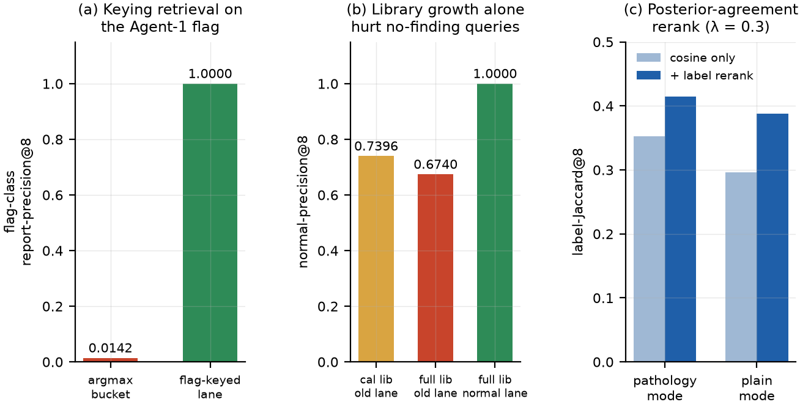

# Agent 2: Similar-Case Retrieval

Agent 1 answers *should I trust this prediction?* Agent 2 answers the reviewer's next question: *show me cases like this one*. This chapter describes how that was built and, more importantly, what measuring it revealed. Section 6.1 sets out the design and the invariant that governs it. Section 6.2 covers the index and its validation. Section 6.3 reports a result that runs against intuition — enlarging the reference library made an important class of queries *worse*. Section 6.4 presents the coupling to Agent 1 that is the chapter's main contribution, and Section 6.5 the reranking that refines it. Section 6.6 reports a null result that was kept rather than discarded.

## Design and the label-free invariant

The retrieval component embeds a query radiograph with the ensemble's RAD-DINO member, searches a library of previously seen cases for the nearest neighbours in that space, and returns them with the metadata a reviewer needs: the model's prediction on each neighbour, whether that prediction was correct, and whether the neighbour's report confirms the finding at issue.

One invariant governs the implementation and is enforced by test: **ground truth never enters the vector store**. The index holds identifiers and vectors only. Prediction metadata lives in a separate sidecar joined after retrieval, and the query-time path uses no label belonging to the query — at deployment the query has no label. This matters because a retrieval system that indexes labels can trivially appear to work by retrieving cases with the same label, which is not a capability the deployed system has.

The embedding is the adapted RAD-DINO 1536-dimensional representation from Chapter 5. Cosine similarity over that space is meaningful in a way the alternatives were not: random-pair cosine similarity is 0.081 in the RAD-DINO space against 0.663 and 0.708 in the from-scratch ResNet-18 and ViT-Tiny spaces. Those from-scratch representations are visibly collapsed — nearest-neighbour similarity of 0.97 against a random-pair baseline of 0.66 is only about 1.7 standard deviations of evidence, against RAD-DINO's 7.7 — and are retained only as the model-matched control for the Chapter 5 comparison, never as a retrieval space to deploy. The same low dynamic range that makes those spaces poor for retrieval is the phenomenon that, in the output layer, produces the saturated confident stratum of Section 5.7; it is one property observed in two places.

## Index and validation

Search uses hierarchical navigable small-world graphs [@malkov2020] via `hnswlib`, with cosine space, M = 32, construction parameter 400 and search parameter 512. FAISS [@johnson2021faiss] was the alternative considered; HNSW was chosen because the workload is a single CPU-resident index with metadata-filtered queries, and `hnswlib` supports a traversal-time filter predicate, which permits filtering *during* graph traversal rather than over-fetching and filtering afterwards. That property is what makes the narrow candidate pools of Sections 6.3 and 6.4 tractable.

Approximation is validated rather than assumed: for every index built, recall at 10 against exact brute-force cosine search is measured over 200 evaluation queries. All three production indexes return **recall@10 = 1.0000**.

The deployed library holds **129,113 cases** — the entire ReXGradient training, calibration and evaluation set. Two of the three splits have exact embeddings from the saved arrays; the 112,967 training rows had to be re-embedded from the pre-decoded image cache through the adapted encoder. That path was gated rather than trusted: 256 calibration rows were pushed through the cache path and compared against their known array embeddings, giving a median cosine of 0.9983 and a fifth percentile of 0.9925. The gate passed before the full build ran.

A note on the search space itself: adapting the encoder (Section 5.6) *contracts* the representation toward the case library, with median top-1 cosine similarity from evaluation queries to their nearest calibration reference rising from 0.520 to 0.614 and mean top-8 similarity from 0.472 to 0.568. Adapted queries sit closer to their references, which is the retrieval-side signature of "in-domain".

## Enlarging the library made one query class worse

The first index covered only the 8,064-case calibration split. Expanding to 129,113 cases was expected to be a straightforward improvement, and for most queries it was: candidate pools for pathology-specific retrieval went from empty for ten of the fourteen findings to, for example, 10,009 for Infiltration and 3,762 for Cardiomegaly.

For one important query class it was a regression. For a query that reads as *no finding* — which is the majority of a screening workload, and 65% of evaluation queries read this way under the Youden rule — the pre-existing behaviour selected neighbours by the prediction's argmax bucket. On the small library that returned mostly unremarkable films by accident. On the enlarged library the argmax bucket floods with pathology-dominant neighbours, and normal-precision at 8 — the share of the returned neighbours that genuinely have no finding — **fell from 0.7396 to 0.6740**. Naive library expansion actively hurt.

The fix was a dedicated retrieval lane whose candidate pool is defined by the predicate rather than by proximity within a bucket: 66,306 library rows that are ground-truth normal with certain labels, plus a fallback that routes a query reading as no-finding into that lane. Measured over 2,000 evaluation queries with genuine no-finding labels, normal-precision at 8 becomes **1.0000**. {{fig:ch6-gates}}(b) shows all three arms.

The general lesson is worth stating because it applies beyond retrieval: **scaling a component's data can degrade a use case that was previously succeeding for the wrong reason.** Only measuring the specific use case exposed it.

## Keying retrieval on the uncertainty flag

The chapter's main contribution came from a failure visible in the demonstration application. On a confident-error case, Agent 1's Region B correctly flagged **Cardiomegaly** — a confident false negative. Retrieval, however, keyed on the prediction's argmax, which on that film was a spurious Hernia at probability 0.394, and duly returned neighbours with confirmed Hernia. The retrieval was working exactly as specified and was useless: it answered a question about the model's top guess when the reviewer needed cases relevant to the *flagged* finding.

The fix makes the Agent-1-to-Agent-2 coupling explicit. The retrieval key becomes the Region-B-flagged class with the highest calibrated confidence — model internals only, no query label — and the candidate pool becomes library rows whose *report* confirms that class, with labeller-uncertain rows excluded.

The effect is definitional in one direction and enormous in magnitude. Over 2,000 evaluation queries on which Region B fires, the share of returned neighbours whose report confirms the flagged class rises from **0.0142 to 1.0000** ({{fig:ch6-gates}}(a)), from a candidate pool of about 14,500, so there is no starvation. The cost is visual: mean cosine similarity at 8 falls from 0.63 to 0.49. That is the expected and acceptable price of keying on a clinically relevant finding rather than on raw pixel proximity, and it is reported rather than hidden.

{#fig:ch6-gates}

A complementary *contrast* lane answers the opposite question — "did the model ever call this finding correctly on a similar film?" — by requiring both that the model itself reads the candidate as positive for the flagged class and that the report confirms it. Over the same queries the share of neighbours the model itself detected rises from 0.0018 to 1.0000, from a pool of about 1,500, at a cosine of 0.33. Together the flag and contrast lanes give a reviewer both sides of a Region B flag: comparable cases with the finding present, and comparable cases where the model successfully called it.

The application resolves these automatically. The default mode is `auto`, which selects the flag lane when Region B fires and the correct-cases lane otherwise, and displays the resolution it chose. The original argmax-keyed pathology mode was **retired**: it was the weakest lane, with 1.4% flag-precision and 0.2% model-detected neighbours, and its failure mode is exactly what the flag lane fixes. Its no-finding fallback survives as the normal lane, and the historical arms are retained as baselines in the gate reports.

One further design decision is worth recording. The correct-cases lane draws only from the calibration and evaluation splits, a pool of 5,540 cases, and deliberately excludes the 112,967 training rows even though they are in the index. The adapted members were trained on those labels, so a training-split "the model got this right" annotation is contaminated by memorisation. The exclusion is by design and is surfaced in the application's caption rather than left implicit.

## Posterior-agreement reranking

Visual proximity and clinical relevance are correlated but not identical, so a second-stage rerank re-scores the visual top-32 by a convex combination of cosine similarity and label agreement, at a weight of 0.3 on agreement. The query side contributes only the model's own posterior — the query has no label at retrieval time — while the reference side contributes report-derived labels, with uncertain entries excluded on both sides.

Over 500 confident evaluation queries, label-Jaccard at 8 rises from 0.3526 to **0.4148** in pathology mode and from 0.2963 to **0.3880** in plain mode, and posterior agreement at 8 rises from 0.737 to 0.989 and from 0.642 to 0.980, at a cosine cost of about 0.02 ({{fig:ch6-gates}}(c)). The rerank is disabled in the correct-cases and normal lanes, whose pools are already exact predicates and for which reranking would only add noise.

## A null result, kept

An attractive hypothesis presented itself late: if the retrieved neighbours' reports mostly confirm the flagged class, perhaps that agreement is itself an error signal — a *neighbour vote* that could rank confident errors within the flagged population.

It does not. Over the Region-B-firing evaluation rows, the AUROC of one minus the vote for ranking confident errors is **0.4527**, with a 95% confidence interval of [0.336, 0.527] on only 14 confident-error rows. The direction is if anything reversed: the mean vote is 0.062 on wrong films against 0.012 on correct ones, meaning neighbours' reports confirm the flagged class *more* often when the model is wrong. The comparison baselines are equally flat — 0.505 for negated maximum standard deviation and 0.431 for one minus confidence — which is the informative part: **within an already-flagged population, the residual variation in disagreement, confidence and neighbour agreement carries no further error signal.** The flag has already extracted what is there.

The vote is therefore retained as a display element in the interface, where telling a reviewer that six of eight comparable films had this finding confirmed is genuinely useful context, and is explicitly *not* used as a score. It is reported here because a plausible feature that measurement did not support is part of the evidence, and because the confidence interval on 14 errors is exactly the situation Chapter 5 taught this project not to over-read.

## Summary

Agent 2 delivers a validated approximate-nearest-neighbour index over 129,113 cases with exact recall, a label-free store, six retrieval modes and an automatic mode selection driven by Agent 1's flag. The measured contributions are the flag-keyed lane (0.0142 to 1.0000 flag-class precision), the normal lane that repaired a regression library growth had introduced (0.6740 to 1.0000), and the posterior-agreement rerank (label-Jaccard 0.353 to 0.415). The chapter's transferable finding is that in a retrieval system attached to an uncertainty flag, **the key matters more than the index**: exact recall over a large library bought nothing until the query was keyed on the right question.
