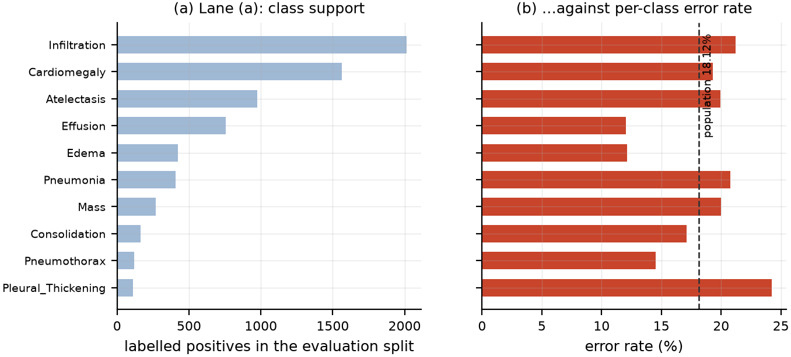
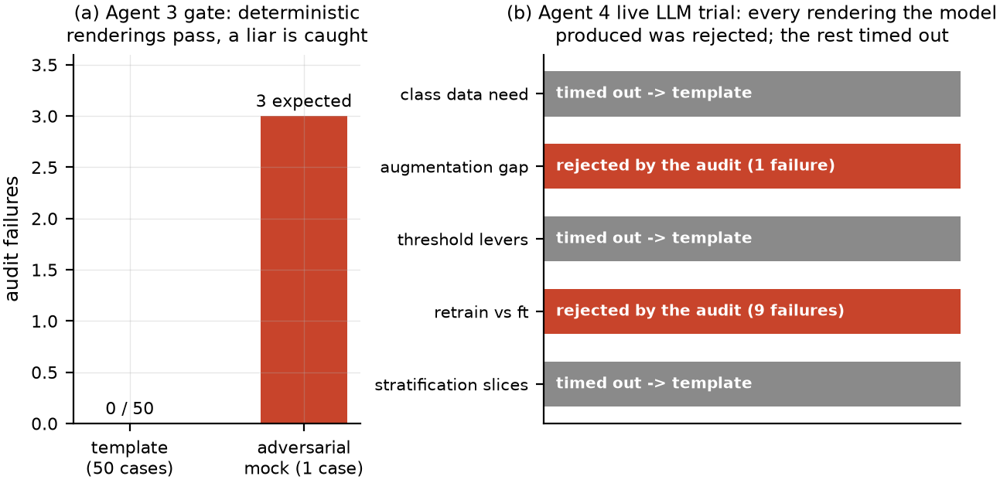

# Agent 4: Population-Level Improvement Suggestion

The first three agents operate on one case. The fourth operates on the whole evaluation split and answers a different question: *given everything this ensemble got wrong, what should be changed?* This chapter describes its five analysis lanes (Section 8.2), the split discipline that keeps its recommendations honest (Section 8.3), the two additional prohibitions its audit enforces (Section 8.4), and the results of running it, including a live language-model trial that the audit largely rejected (Sections 8.5 and 8.6).

## Scope and stance

Agent 4 consumes the adapted ensemble's evaluation-split predictions, labels and derived quantities, and produces improvement hypotheses in the five lanes the brief specified: which classes need more examples, which augmentation strategies to consider, threshold calibration, retraining versus fine-tuning, and metadata-based stratification. It reuses Agent 3's architecture exactly — a deterministic evidence pack with addressable identifiers, a constrained language renderer, and a zero-tolerance mechanical audit — and adds two prohibitions specific to its subject matter.

The stance is stated in the module and enforced by the audit rather than left to the prose. Every finding is **correlational**, obtained from one fixed evaluation split with no intervention; causal language is banned. **Agent 4 never executes anything**; language asserting an action taken or to be taken is banned. And every number in the prose must ground to a computed leaf. This matters more here than for Agent 3, because a plausible-sounding improvement recommendation is the kind of output a team acts on, and an ungrounded one wastes weeks of engineering.

The evidence pack over the 8,082-image evaluation split contains 1,010 addressable leaves covering 78,311 labelled cells with 14,192 errors, an overall error rate of 18.12%.

## The five lanes

**Lane (a) — class data need.** For each pathology the lane reports labelled positives and negatives, ambiguous cells, prevalence across the training, calibration and evaluation splits with the drift between them, a support rank, error rate, false-positive and false-negative counts, and sensitivity with a bootstrap confidence interval. {{fig:ch8-lanes}} shows support against error rate.

{#fig:ch8-lanes}

The lane's most important output is a refusal. Four classes — Nodule, Emphysema, Fibrosis and Hernia — have no labelled evaluation cells at all, because the CheXpert-to-NIH mapping does not define them. The lane reports these as **unmeasurable, explicitly not as classes needing more data**. That distinction is the difference between a correct recommendation and an expensive mistake: "we cannot assess this class" and "this class needs more examples" call for entirely different responses, and a naive analysis conflates them because both look like an absence.

**Lane (b) — augmentation gap.** The lane first states the repository's actual training policy, read from the training code rather than assumed: horizontal flip at probability 0.5 plus rotation of ±10 degrees for all four adapted members, with ConvNeXt-V2 using horizontal flip only; absent from the codebase are CLAHE and contrast augmentation, blur and sharpness, vertical flip, and brightness or contrast jitter; and there are no test-time transforms beyond resize and normalise. It then compares error films against non-error films within each projection across eight measured quality metrics, banded by the quintile tables from Agent 3's calibration, and proposes an augmentation only where a band actually separates the two populations.

On this split **no quality metric separates error from non-error films**, so the lane's honest output is that no image-quality lever is identified. This is a null result and is reported as one. It is also, taken with lane (e) below, informative: the errors of an adapted ensemble on in-domain data are not concentrated in poor-quality films.

**Lane (c) — threshold levers.** For each pathology the lane reports the current operating threshold, the counts of false positives and false negatives at it, the false-positive to false-negative ratio and an asymmetry band, a candidate threshold refit by an F-beta criterion with beta = 2, and the resulting counts. It also reports how much of the total error mass sits close enough to a threshold to be reachable by moving one.

The headline is a strong asymmetry. Pleural Thickening carries 1,919 false positives against 31 false negatives on the evaluation split, a ratio of 62 to 1, and 48.54% of all error cells sit within the near-threshold window. On the calibration split the refit moves that class's threshold from 0.020 to 0.056 and takes calibration false positives from 1,766 to 364 at a cost of 23 to 52 false negatives. Nearly half the ensemble's errors are, in principle, reachable by threshold placement rather than by retraining — which, if acted on, is the cheapest available lever.

The lane also carries a precedent note taken from this project's own history: earlier calibration work fitted thresholds for Mass, Pneumothorax and Fibrosis on four, ten and seven positives respectively and found them noise-driven. The same small-*n* mechanism applies wherever positives are scarce, and the note is attached so that a reader does not act on a threshold fitted from a handful of cases. This is Chapter 5's lesson embedded as a standing caution in the system's own output.

**Lane (d) — retrain versus fine-tune.** For each pathology the lane computes a correctness-relevant AUROC with a bootstrap confidence interval and assigns a lever. On this split the verdict is uniform: ten classes resolve to `threshold_calibration`, four to `unmeasurable`, and exactly one — Pleural Thickening — to `fine_tune`. Atelectasis, for example, has AUROC 0.8998 with interval [0.8899, 0.9103] and resolves to threshold calibration.

The lane also checks whether any *retraining trigger* is present, and reports that none is: the median Mahalanobis distance on error rows differs from the population by only 6.27%, and neither the out-of-distribution mass nor the measured quality bands separate error rows from the population. The ordering it recommends is cost-first — threshold calibration before fine-tuning before data collection — which follows directly from that absence of a trigger.

**Lane (e) — stratification slices.** The lane reports error rates by projection and by embedding cluster, with clustered-by-patient bootstrap intervals and a reporting floor.

By projection, AP films carry an error rate of 20.58% against PA's 11.72%, a ratio of 1.14 and 0.65 respectively against the population, with non-overlapping intervals ([19.93, 21.29] and [10.97, 12.44]). AP radiographs are typically acquired at the bedside on less mobile patients, so this is a clinically plausible slice rather than a numerical artefact. A third projection tag with ten images is **suppressed by the reporting floor** rather than reported with a wide interval, which is the correct behaviour.

By embedding cluster the spread is wider: one cluster of 1,197 images carries a 37.29% error rate, more than twice the population rate, with Mass as its most frequent error class, while a cluster of 2,605 images carries 8.78%, with Infiltration. The clustering is unsupervised over the RAD-DINO representation, so these are visually coherent groups the model finds hard, and they are the most actionable stratification output the lane produces.

## Split discipline

Lane (c) recommends threshold changes, which creates an obvious way to cheat: refit thresholds on the evaluation split, report the improvement, and present a number that will not survive deployment. The lane therefore refits **only on the calibration split**, and reports evaluation-split effects descriptively. The evidence pack carries an explicit flag, `eval_used_for_selection: false`, and a unit test asserts it. The flag exists so a reader does not have to take the claim on trust.

Two further statistical controls are worth naming. All interval estimates resample **patient codes rather than rows**, because a patient contributing many images would otherwise produce anti-conservatively narrow intervals — the same clustering concern that motivated patient-level splitting in Section 3.4. And all share-like quantities are stored on a 0–100 scale rather than as fractions, so that a renderer writing "20.6%" grounds numerically against the stored leaf; storing 0.206 would cause every such sentence to fail the numeric check for a purely representational reason.

## The audit, with two additional bans

Agent 4 inherits Agent 3's four checks — citation validity, numeric grounding, class grounding and band agreement — and adds three.

- **Causal-language ban.** Terms such as *causes*, *because of*, *leads to*, *results in*, *will fix* and *proves* are rejected. These are correlations on one fixed split.
- **Execution ban.** Constructions asserting an action taken or to be taken — "we will retrain", "execute" — are rejected. Agent 4 suggests; it does not run.
- **Intervention grounding.** A named intervention concept (CLAHE, rotation, flip, blur, jitter, threshold, fine-tune, retrain) must appear in the evidence, so the renderer cannot propose a technique the analysis did not consider.

The prompt additionally warns against a specific confusion the evidence makes easy: *few positives* and *a high false-positive rate* are different diagnoses calling for different responses, and must not be conflated.

## Results: the deterministic gate

The deterministic template renderer passes the audit on **all five lanes**, with zero failures. As with Agent 3, this is run first and is the precondition for attempting any language-model rendering: it establishes that the audit is passable and that the fallback path is sound.

## Results: the live language-model trial

The same evidence pack was then rendered by a language model through the provider chain, with a 60-second per-lane timeout. Across five lanes the outcome was: three lanes **timed out** and fell back to the template, and the two renderings the model did produce were **both rejected by the audit**. {{fig:ch7-audit}} summarises this alongside Agent 3's deterministic gate.

{#fig:ch7-audit}

The rejection reasons are the substance of this result, because they are the failures a human reviewer would plausibly have missed.

The augmentation lane's rejected rendering was flagged for an **ungrounded number**: it wrote a figure that appeared in none of the leaves it cited. The sentence was fluent, correctly cited by form, and about a real topic; only the numeric check caught it.

The retrain lane's rejected rendering failed more comprehensively — nine failures in one paragraph: four invalid citations and five ungrounded numbers. Its citation failures are instructive: the model concatenated several evidence identifiers inside a single bracket, producing citations that resolve to nothing while looking entirely plausible. It also emitted values such as 855.8 and 805.2, which are close to real Mahalanobis medians in the pack but were attached to sentences whose cited leaves did not contain them.

Three observations follow. First, **the audit is doing real work on real output**: both renderings the model produced — fluent paragraphs a reader would very likely have accepted — contained unsupported claims. Second, the failures are of exactly the kind human review is worst at: a plausible number next to a plausible-looking citation. Third, in every case the reader receives the deterministic template plus an explicit note, so the worst case is a stilted paragraph rather than a fabricated recommendation.

A caveat on generalisation: this is five lanes on one evidence pack with one model, and the timeouts mean the sample of *produced* renderings is two. It is a demonstration that the gate fires on live output, not an estimate of a hallucination rate; a rate would need many packs and several models. The 60-second timeout is a property of the local inference setup rather than of the method, and an earlier run of the same command produced a different timeout pattern — one accepted rendering, two timeouts, two rejections — which is worth recording because it shows the rejections are reproducible while the timeouts are not.

## Reflection

The most useful thing Agent 4 produced is not a suggestion but a refusal. Two of its five lanes returned essentially negative findings — no image-quality lever separates error films, and no retraining trigger is present — and a third declined to assess four classes on the grounds that they carry no labels. A suggestion agent that always produces confident suggestions is worse than useless in a clinical engineering context, because its output cannot be distinguished from noise. The lanes that did fire, in contrast, are specific and checkable: nearly half the error mass is threshold-reachable, one class is false-positive-dominated by a factor of 62, AP films carry a 1.75× higher error rate than PA films, and one visually coherent cluster of 1,197 images carries more than twice the population error rate.
